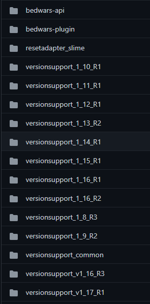

# Contributing to BedWars1058
👍 First off, thanks for taking the time to contribute!

The following is a set of guidelines for contributing to BedWars1058. 
These are mostly guidelines, not rules. Use your best judgment, and feel free 
to propose changes to this document in a pull request.

### What should I know before I get started?
#### BedWars1058 and its structure

  
We have a module for the public API called `bedwars-api` where we expose 
some parts of the mini-game. The magic happens in the `bedwars-plugin`
module and the others starting by `versionsupport_` are used to handle specific
version-based code. Since BedWars1058 has multi-version support and it does not
rely on Reflection we need to create a new module for each new MC version.
`versionsupport_common` defines what needs to be handled differently 
by each MC version support.

## How Can I Contribute?
#### Reporting Bugs

When you are [creating a bug report](https://github.com/andrei1058/BedWars1058/issues/new), please include as many details as possible.
Fill out the required template, the information it asks for helps us resolve issues faster.

> **Note:** If you find a **Closed** issue that seems like it is the same thing that you're experiencing, open a new issue and include a link to the original issue in the body of your new one.

### Suggesting Enhancements
Enhancement suggestions are tracked as GitHub issues, so you need to 
[open a new issue](https://github.com/andrei1058/BedWars1058/issues/new) 
and provide the following information:  
- Use a clear and descriptive title for the issue to identify the suggestion.
- Provide a step-by-step description of the suggested enhancement in as many details as possible.
- Describe the current behavior and explain which behavior you expected to see instead and why.
- Explain why this enhancement would be useful.
- Specify which version of BedWars you're using.

### Your First Code Contribution
Unsure where to begin contributing to BedWars1058? 
You can start by looking through these `beginner` and `help-wanted` issues:
- [Beginner issues](beginner) - issues which should only require a few lines of code, and a test or two.
- [Help wanted issues](help-wanted) - issues which should be a bit more involved than beginner issues.
  
  
#### Local development
Before starting make sure you have `git`, `java` and `maven` installed.
The plugin can be developed locally by cloning this repository, applying your
changes and building the jar running `mvn clean install`.

## Pull Requests
Please follow all instructions in the template to have your contribution
considered by the maintainers:
1. Copy the correct template for your contribution:
  - 🐛 Are you fixing a bug? Copy the template [from here](.github/templates/contributing/bug_fix.md).
  - 📈 Are you improving performance? Copy the template [from here](.github/templates/contributing/performance_improvement.md).
  - 📝 Are you updating documentation? Copy the template [from here](.github/templates/contributing/documentation.md).
  - 💻 Are you changing functionality? Copy the template [from here](.github/templates/contributing/feature_change.md).
2. Replace this text with the contents of the template
3. Fill in all sections of the template
4. Click "Create pull request"

# Additional Notes

### Issue and Pull Request Labels
| Label name | Description |  
| ---  | --- |
| `enhancement` | Feature requests. |
| `bug` | Confirmed bugs or reports that are very likely to be bugs. |
| `question` | Questions more than bug reports or feature requests (e.g. how do I do X). |
| `feedback` | General feedback more than bug reports or feature requests. |
| `help-wanted` | The team would appreciate help from the community in resolving these issues. |
| `beginner` | Less complex issues which would be good first issues to work on for users who want to contribute. |
| `more-information-needed` | More information needs to be collected about these problems or feature requests (e.g. steps to reproduce). |
| `needs-reproduction` | Likely bugs, but haven't been reliably reproduced. |
| `duplicate` | Issues which are duplicates of other issues, i.e. they have been reported before. |
| `wontfix` | The team has decided not to fix these issues for now, either because they're working as intended or for some other reason. |
| `invalid` | Issues which aren't valid (e.g. user errors). |

### Pull Request Labels

| Label name | Description
| --- | --- |
| `work-in-progress` | Pull requests which are still being worked on, more changes will follow. |
| `needs-review` | Pull requests which need code review, and approval from maintainers or 
core team. |
| `under-review` | Pull requests being reviewed by maintainers. |
| `requires-changes` | Pull requests which need to be updated based on review comments and then reviewed again. |
| `needs-testing` | Pull requests which need manual testing. |

# How to add support for a new Minecraft version

First give a look at the project structure above on this page, clone the versionsupport of 
the latest supported version and then make sure to rename the package and class, plus update 
the pom file with the new version name.

At this point make sure to map the following aspects on the new NMS:
- Pathfinders for goals and targets in `DespawnableProvider`
- `PlayerConnection` used to send packets in `v1_nn_Rx` class
- Glass and other modified blocks in `v1_nn_Rx#registerTntWhitelist`
- NBTTags in `v1_nn_Rx` for Item, Entity and ItemStacks
- eventually other functions that were not mapped yet by spigot

For your update to go live, [SidebarLib](https://github.com/andrei1058/SidebarLib) needs to be updated to your new version as well.
