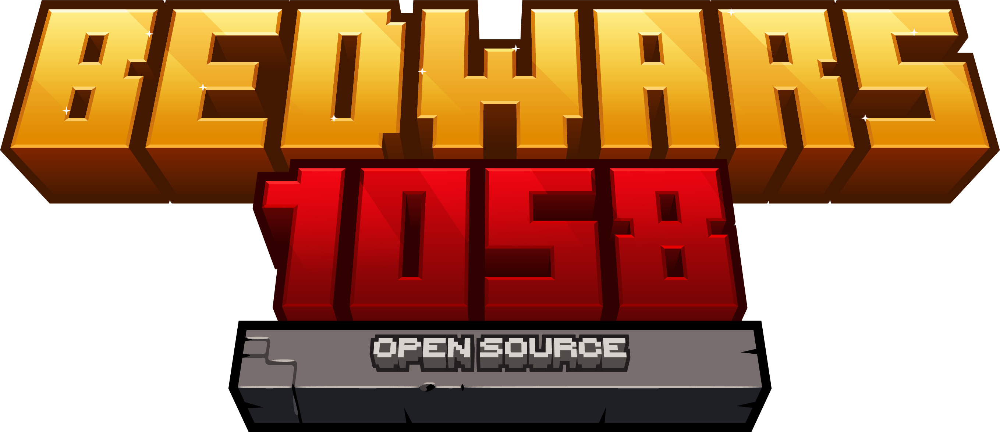

As from November 1st 2021 BedWars1058 by Andrei Dascălu becomes open source under GNU GPL 3.0 license. If you are a developer I would really appreciate if you'd come with pull requests instead of making hundreds of forks. Let's make updates available for everyone!

# Description
BedWars is a mini-game where you have to defend your bed and destroy the others.  
Once your bed is destroyed, you cannot respawn.

# System requirements
This software runs on [Spigot](https://www.spigotmc.org/) and NMS.
Spigot forks without compiled NMS code are not supported.
Officially supported servers are [spigot](https://www.spigotmc.org/) and [paper](https://papermc.io/).
It is required to use **Java 11** or newer.

The internal world restore system is based on zipping and unzipping maps which can become
heavy if you are still making use of HDDs and you do not have a decent CPU, for a better
and faster restore system we recommend using one of the following solutions:
- [SlimeWorldManager](https://www.spigotmc.org/resources/slimeworldmanager.69974/) plug-in (v2.2.1 **only**)
- [AdvancedWorldManager](https://www.spigotmc.org/resources/advanced-slimeworldmanager.87209/) plug-in (v2.8.0 **only**)
- [AdvancedSlimePaper](https://github.com/InfernalSuite/AdvancedSlimePaper) server jar (**1.20 or newer**)

BedWars1058 will hook into it and do everything for you, no additional configuration is needed.

# Pre-made setups and community add-ons

You can find a list of pre-made server setups and a lot of community add-ons [on BedWars1058 Wiki](https://wiki.andrei1058.dev/docs/BedWars1058/addons).

# Main features

###### Flexible | Ways you can run the plugin:
- **SHARED**: can run among other mini-games on the same spigot instance. Games will only be accessible via commands.
- **MULTIARENA**: will require an entire server instance for hosting the mini-game. It will protect the lobby world and games can be joined via commands, NPCs, signs and GUIs.
- **BUNGEE-LEGACY**: the old classic bungee mode where a game means an entire server instance. You'll be added to the game when joining the server. Arena status will be displayed as MOTD.
- **BUNGEE**: a brand new scalable bungee mode. It can host multiple arenas on the same server instance, clone and start new arenas when needed so other players can join. The server can be automatically restarted after a certain amount of games played. This will require installing [BedWarsProxy](https://www.spigotmc.org/resources/bedwarsproxy.66642/) on your lobby servers so players can join. And of course, you can run as many servers as you want in bungee mode.

###### Language | Per player language system:
- each player can receive messages, holograms, GUIs etc. in their desired language. /bw lang.
- you can either remove or add new languages.
- team names, group names, shop contents and a lot more can be translated in your languages.
- custom titles and subtitles for [starting countdown](https://gitlab.com/andrei1058/BedWars1058/-/wikis/language-configuration#custom-title-sub-title-for-arena-countdown).

###### Lobby removal | Optional:
The waiting-lobby inside the map can be removed once the game starts.

###### Arena Groups | Customization:
- you can group arenas by type (4v4, 50v50). You can name them however you want.
- groups can have custom scoreboard layouts, team upgrades, start items and custom generator settings.
- you can join maps by group: /bw join Solo, /bw gui Solo.

###### Shop | Customization:
- you may configure quick-buy default items.
- you may add or remove categories.
- you may add new shop items or execute commands when bought.
- permanent items are given after you re-spawn.
- permanent items can be downgradable which will make you lose one tier per death.
- items can have weight so you can't buy a weaker item than your current one etc.
- special items available: BedBug, Dream Defender, Egg Bridge, TNT Jump and Straight Fireball.
- quick buy feature is available and is synced between nodes as well in bungee mode.

###### Team Upgrades | Customization:
- you may have different team upgrades per arena group.
- you may either add and remove categories and contents.
- you may make upgrade elements that: enchant items, give potion effects (to team-mates/ base/ enemies when they enter the island), you can edit generator settings and change the dragons amount for the Sudden Death phase.
- you may add new traps that: disenchant-items (sword, armor, bow), give potion effects (team/ base/ enemies), remove potion effect when an enemy enters your island range and trigger commands.

###### Ways to join an arena:

- arena selector, which can be configured. /bw gui will display all arena groups while /bw gui Solo will show games from Solo groups and /bw gui Solo+4v4 will show games from Solo and 4v4.
- you can also join games via NPCs by installing Citizens.
- join-signs are also available with status block.
- commands can be used as well. /bw join random will bring you the most filled arena, while /bw join mapName will send you to the given arena and /bw join groupName+groupName2 will bring you on a map from the given groups.

###### Arena Settings | Customization:
- you can set a custom display name used on signs, GUIs etc.
- option to set the amount of min/ max players and team size.
- toggle options for: allowing spectators, disabling generators for empty teams, disabling NPCs for empty teams, disabling internal drops management, bed holograms usage.
- protection range for team-spawn and team NPCs.
- island radius (for features like triggering traps and map) border radius.
- instant kill on void based on Y coordinate.
- you can create as many teams as you want.
- you can allow map breaking like on a SkyWars game.
- you can toggle generator split.
- custom game rules per map.
- unlimited iron/ gold / emerald (this one can pe activated from upgrades) generators per team.

###### Vip Kick | Privilege:
Players with bw.vip permission are able to join full arenas in starting phase. This will kick a player without bw.vip permission from that game.

###### Player Statistics:
- we do not provide top holograms but you can use ajLeaderboards for that or LeaderHeads using the placeholders we provide.
- players can see their stats using the internal stats GUI, which can be customized and accessed by /bw stats.

###### Party System:
- we provide a basic and functional internal party system to play with your friends on the same team or arena.
- we also support Parties by AlessioDP and Party and Friends by Simonsator which could be a better solution if you are a large network.

###### Anti AFK System:
Inactive players for more than 45 seconds can't pick-up items from generators.

###### Custom Join Items:
- you can add and remove items that you receive when you join the server (only on multi-arena) and the items you receive when you join a game in starting/ waiting phase or when you join as a spectator.
- join items can execute commands.

###### Map Restore System:
- the default restore adapter from BedWars1058 is based on un-loading the map, un-zipping a backup and loading it again. This may be heavy for servers with cheap hardware. We recommend using gaming processors and a SSD.
- to improve performance we added support for SlimeWorldManager, which loads maps way faster with less performance impact thanks to its slime format. We really encourage you installing this plugin. No manual conversion is required. BedWars1058 will handle everything. Read how to install it here.
- you can also implement your own map adapter trough the API.
- it may seem heavy than other plugins because we don't simply keep track of modified blocks. We need to restore the entire map because server owners can allow players to destroy the maps like on a SkyWars game. Regions like generators, NPCs and team spawns will be protected.

###### Re-Join | Feature:
If you get disconnected, or if you leave a game (configurable) you can re-join it via command or by joining the server again. This is also available in bungee scalable mode.

###### TNT Jump | Feature:
- players are able to do tnt jump with configurable values.
- players with tnt in their inventory have a red particle on their head (configurable).

###### Season events:
- Halloween special. It is enabled automatically based on your machine timezone and will provide cool effects.

# Contributing
Any help is appreciated, just give a quick look at [CONTRIBUTING.md](https://github.com/andrei1058/BedWars1058/blob/master/CONTRIBUTING.md) first!

If you are not a programmer you can help answering people in the [Issues](https://github.com/andrei1058/BedWars1058/issues) section or even [translate the plugin in your languae on Crowdin](https://crowdin.com/project/bedwars1058).

### Translation progress
[Translation Chart](https://badges.awesome-crowdin.com/translation-12780139-594479.png)

# 3rd party libraries
- [bStats](https://bstats.org/getting-started/include-metrics)
- [SidebarLib](https://github.com/andrei1058/SiderbarLib)
- [Commons IO](https://mvnrepository.com/artifact/commons-io/commons-io)
- [HikariCP](https://mvnrepository.com/artifact/com.zaxxer/HikariCP)
- [SLF4J](http://www.slf4j.org/)

# Contact

# Special Thanks To

Jetbrains supports BedWars1058 with their [Open Source Licenses](https://www.jetbrains.com/opensource/).
